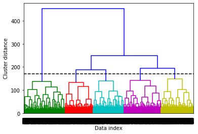
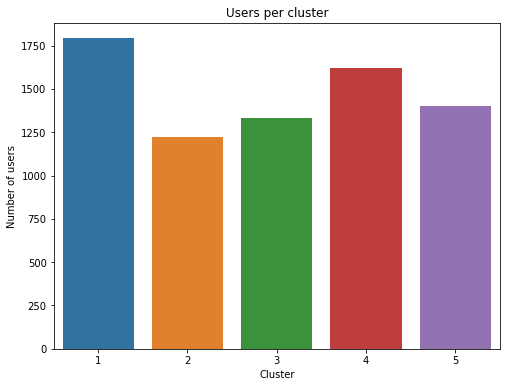
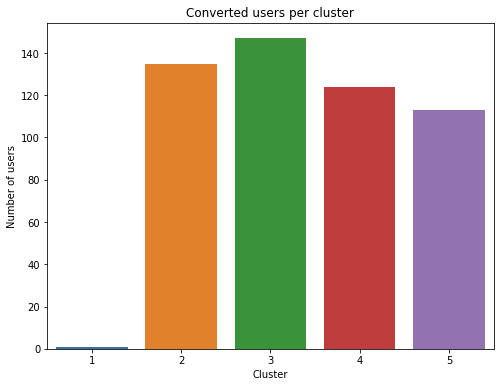
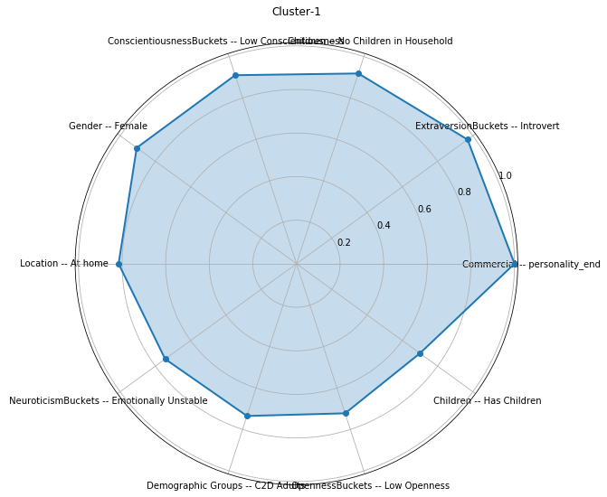
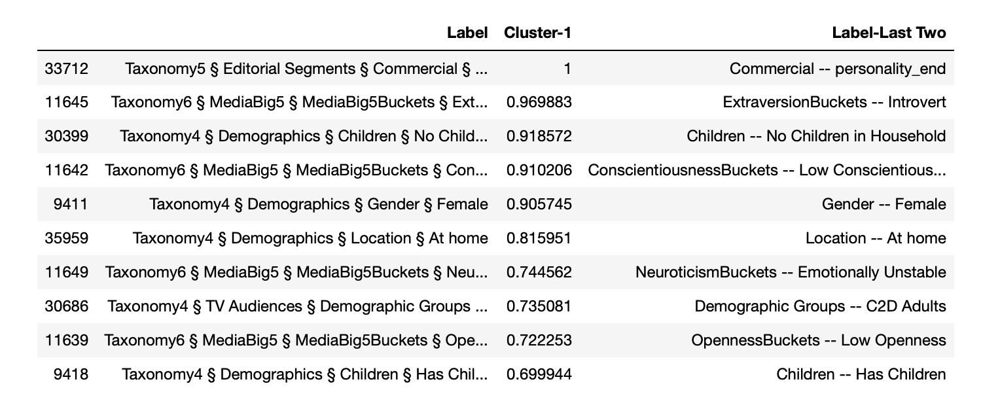
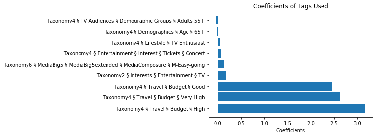

## Finding Potential Customers to advertise Carribean Holiday Tour
[Link to the Presentation](https://docs.google.com/presentation/d/1ukhAwtUhIT5t6aW-20PqQZkMVJR7VGjkqZSj5Iak8Gk/edit?usp=sharing)

### Executive Summary
The data used in the task is generated using a quiz similar to [this](http://you.visualdna.com/quiz/whoami#/quiz). The information about the data and methodology is given in the section below. As our client is a Carribean Holiday Operator looking to advertise their trips to potential customers online, it was required to predict the probability of the users in the 'submission.csv' file. 
  
After cleaning the data, users were classified into 5 clusters using dendograms. Following is the distribution of the clusters obtained:

Cluster distribution for the users who bought the tour in the past shows that they don't lie in cluster-1. Their distribution is as follows:

Following are the top characteristics of users in cluster-1:

- After running the base model and finalizing the feature selection based on that, 4 models were tested (Logistic Regression with Lasso Penalty, Random Forest, Random Forest with Hyperparamter Optimization, XGBoost).
  
- In selecting the best performing model, all classification scoring metric including Accuracy, Recall, Precision and F1 scores were compared. 'Recall' was prioritized over other metrices because logically speaking, the cost of False Negative outweighs False Positive, representing the loss of potential sale vs loss of marketing cost.
  
- All the models (except Random Forest) have similar performance but Logistic regression(with Lasso Regularization) is computationally cheap and would be using only 9 columns instead of 226. So, Logistic regression with Lasso Regularization is used to find the final probabilities for the users.

Key Findings:
  
- Based on the initial clustering exercise, users were classified in 5 clusters. This gives insights into personality characteristics and buying patterns of each distinct groups. Users in cluster 1 tend to avoid purchasing holiday packages which is aligned to several characteristics highlighted in the cluster including users who are introverted in nature and enjoys spending time at home. It is recommended to limiting marketing efforts / budget away from this user cluster.
    
- In the models, it was found that features importance tends to be coherent across the board, primarily having a high budget, being in an older demographic group coupled with high media consumption (ie. tv, concerts etc). That said, given the limited marketing budget, it is suggested to target the users for which the predicted probability is very high.

### Methodology
1. **Business Understanding**
    - We are consultants hired by a Caribbean Holiday Operator to advertise their trips to potential customers online.
    - We have list of customers who have bought the tour from them in past. Now we have to predict which of the other users in the dataset are likely to be interested in their offers as well.
   
2. **Data Understanding**  
    - Data is produced using an online quiz where images, corresponding to a particular tag, are shown to the users and user has to select image(s). 
    - We have 4 seperate csv files 'data.csv','taxonomy.csv','conversion.csv','submission.csv'.
    - 'data.csv' contains raw data with user_uids and associated segments, that are identified by an ID corresponding to a label in 'taxonomy.csv. The segments are marked as P (when a user had the opportunity to click on an option in the quiz) and A (when the user actually clicked on an option in the quiz).
    - 'taxonomy.csv' gives category labels for the variables in 'data.csv'.
    - 'conversion.csv' contains a list of customers that have purchased the product in the past.
    - 'submission.csv'contains a list of customers for which predictions have to be made.
    - Calculate and visualize Prevalence to understand the distribution of the options shown to customers and user's response to it.
  
3. **Data Preparation**  
    - Data Visualisations
    - Data Cleaning
    - 'functions.py' incorporates functions required for data cleaning, visualization and displaying model performance metrices
    - Resolving the issue where column marked _A does not have a corresponding _P
    - Removing Multicollinearity
    - Dendograms to identify user clusters and their characteristics.
    - Identify the clusters in which the users who bought the tour lie.
    - Resolving the problem of class imbalance
  
4. **Modelling**
    - Checking for possibility of dimentionality reduction using PCA.
    - Building base Model
    - Checking for feature importance.
    - Model Assessment 
    - Removing the columns where user didn't had the opportunity to click on an option in majority of cases (more than 50 percent).
    - Running multiple models and measuring their performance.
    - Hyperparameter tuning
  
5. **Evaluation**
    - Choosing the best model
    - Running the test set on the best model
  
6. **Future Tasks**
    - Threshold